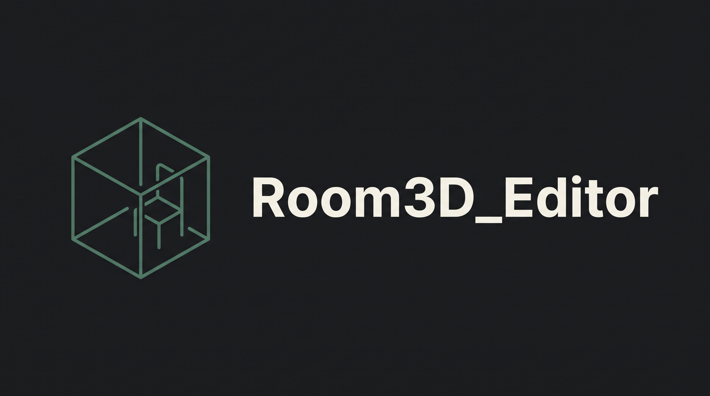
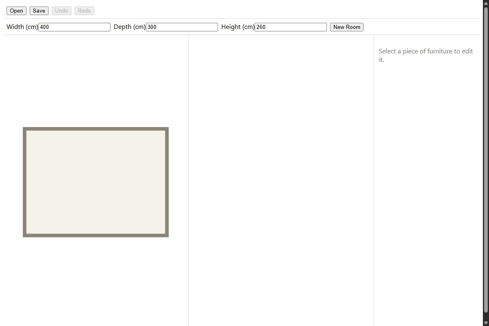
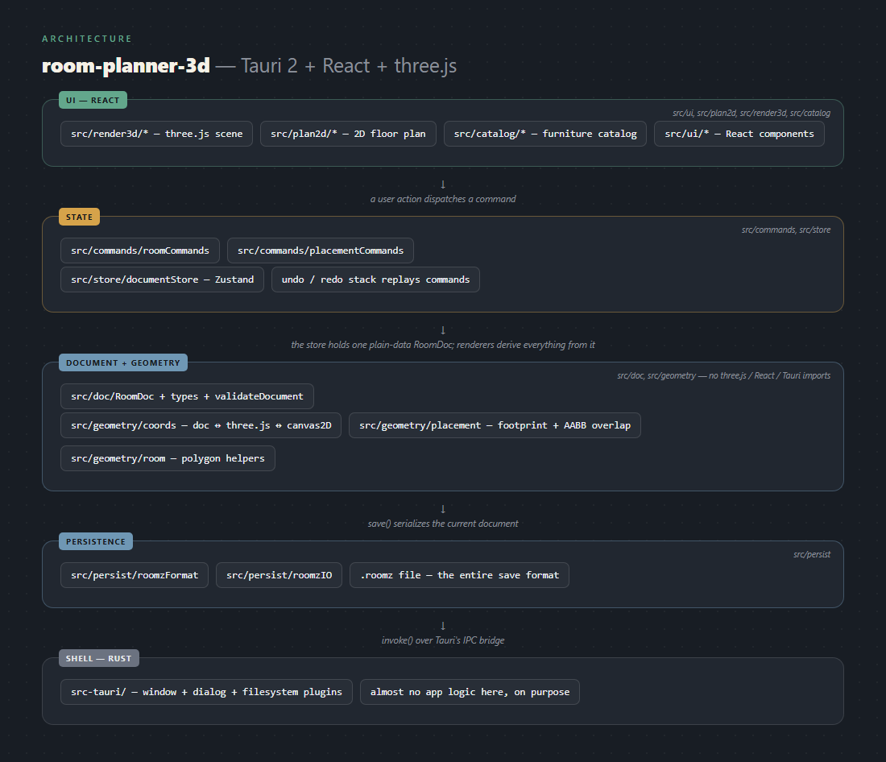

# Room3D_Editor [TEMPLATE]


A desktop app for laying out rooms in 3D — place furniture from a catalog, plan in 2D, preview in
3D, save and reload your layout.

## Showcase



*Real screenshot of the app actually running (`npm run dev`), viewed in a browser rather than the
native Tauri window — same React/three.js UI either way.*

## Stack

Tauri 2 (Rust shell) + React + three.js.

## Running it

```bash
npm install
npm run tauri dev
```

## Architecture



See [ARCHITECTURE.md](./ARCHITECTURE.md) for the full breakdown.

## License

[PolyForm Noncommercial 1.0.0](./LICENSE). Free for personal and non-commercial use —
not for shipping inside a product someone pays for.
