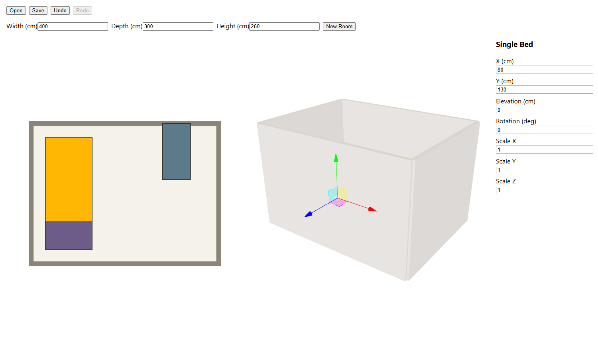
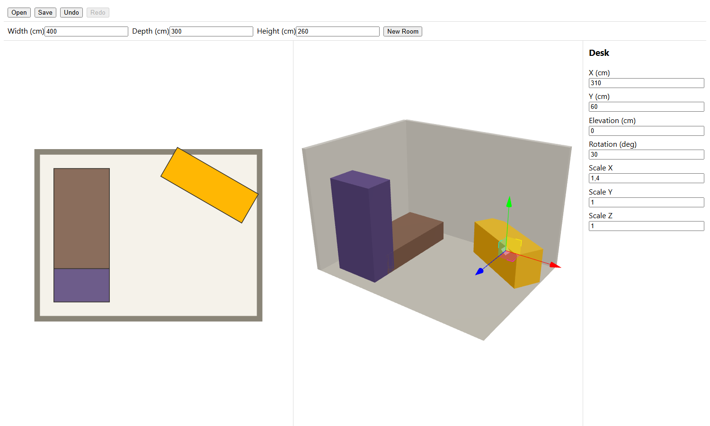

# Room Planner 3D


A desktop app for laying out rooms in 3D — place furniture from a catalog, plan in 2D, preview in
3D, save and reload your layout.

## Showcase





Both captured from `npm run dev` in a browser rather than the native Tauri window — the
React and three.js UI is the same either way. "New Room" drops in a starter bed, desk and
wardrobe; the inspector edits position, rotation and scale, and every edit is undoable.

## Stack

Tauri 2 (Rust shell) + React + three.js.

## Download

Pre-built desktop packages are attached to the [releases](https://github.com/PresidenteOG/room-planner-3d/releases) page.

## Running from source

```bash
npm install
npm run tauri dev
```

## Architecture


See [ARCHITECTURE.md](./ARCHITECTURE.md) for the full breakdown.

## License

[PolyForm Noncommercial 1.0.0](./LICENSE). Free for personal and non-commercial use —
not for shipping inside a product someone pays for.
